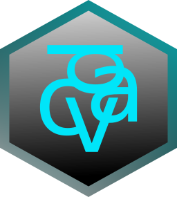
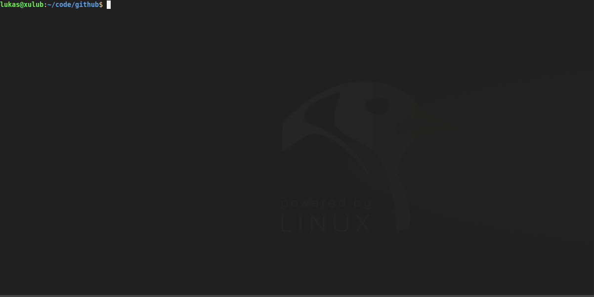

# cdav


[](https://github.com/luv4bytes/cdav)


Scriptable CLI WebDAV client for Linux.

cdav aims to support all operations defined in RFC 4918.
For further information about WebDAV see <a href="https://tools.ietf.org/html/rfc4918">IETF RFC 4918</a>.

## Build

To build cdav make sure to run `make deps` before running `make`. <br>
cdav requires following libraries to be built:

- <a href="http://xmlsoft.org/">libmxl2</a>
- <a href="https://curl.se/libcurl/">libcurl</a>


## How to use cdav...


### On the command line...


SYNTAX:

	cdav -o [OPERATION] ... 

	GET,
	PUT,
	HEAD,
	PROPFIND,
	PROPPATCH,
	MKCOL,
	DELETE,
	COPY,
	MOVE,
	LOCK,
	UNLOCK


ARGUMENTS:

	-a, --address 		-> Target URL.
	-u, --user 		-> User for authentication.
	-pw, --password 	-> Password for authentication.
	--no-redirect 		-> Specifies that redirects should not be followed.
	--proxy 		-> Proxy to use.
	--raw			-> Indicates if responses should be raw XML output or not.
	-f, --file 		-> Commandfile to use for execution.

	-h, --help 		-> Print help text.
	-v, --version 		-> Print version information.

Specific arguments:

GET:		

	-s, --save-as 		-> Filename for saving.	

PUT:	

	-uf, --upload-file 	-> File for upload.	

PROPFIND:	

	-p, --props 		-> Properties to look for.	
	-d, --depth 		-> Depth parameter.

PROPPATCH:	

	-sp, --set-props 	-> Properties to set.
	-rp, --rm-props 	-> Properties to remove.

COPY:	

	-da, --destination-address 	-> Path to copy the resource to.
	--no-overwrite 			-> Specifies if the destination should be overwritten if it exists.

MOVE:

	-da, --destination-address 	-> Path to copy the resource to.
	--no-overwrite 			-> Specifies if the destination should be overwritten if it exists.

LOCK:

	-ls, --lock-scope 	-> Lock scope according to RFC 4918.
	-d, --depth 		-> Depth parameter.
	-lo, --lock-owner 	-> Lock owner.

UNLOCK:

	-lt, --lock-token 	-> Lock token.

Syntax for setting properties:

	[PROPERTY, PROPERTY, PROPERTY=VALUE, PROPERTY={CHILD, CHILD=VALUE, CHILD={CHILD_CHILD}}]

Examples:

	(using command file) cdav -f ./movestuff.cdav

	cdav -o PROPFIND -a https://test.com/dav/test.jpg -p "getcontentlength, getcontenttype" -u somedude -pw verysecret
	cdav -o GET -a https://test.com/dav/test.jpg -s ./test.jpg -u somedude -pw verysecret
	cdav -o PROPPATCH (set) -a https://test.com/dav/test.jpg -sp "prop=value, parent={child=value, child={prop}}" -u somedude -pw verysecret
	cdav -o PROPPATCH (remove) -a https://test.com/dav/test.jpg -rp "prop, other_prop" -u somedude -pw verysecret
	cdav -o MOVE -a https://test.com/dav/test.jpg -da https://test.com/dav/test2.jpg --no-overwrite -u somedude -pw verysecret


### Using a "cdav file"...

cdav can be scripted to do multiple tasks in one Go using a command file.	
The command file consists of three sections.

The first section is the declaration of a "valid cdav file".	
Every command file needs to start with `!cdav!` on the first line.

The second section defines special blocks, at the moment the only "special block" is the variable block called `VAR`.	
Inside the `VAR` block you can define variables used in the command file.

Example `VAR` block:	

```
VAR
{
	user = somedude;
	password= notsosecret;
	
	# Access variables via '$' character.
	# Btw you can use line comments...
}
```

Every block needs to have an identifier e.g. a name, enclosing curly brackets, and the actual content of the block. Value assignments need to end with a semicolon.

Now the third section defines the commands `cdav` should execute. 	
The command blocks contain the exact arguments that you would pass to `cdav` when running it without a command file. Additionally a command block contains an `order` argument. 	
This `order` argument is used to determine in which order `cdav` starts the command blocks and if they are executed parallel.

For example:

```
GET_BLOCK
{
	operation=GET;
	user=$user;		# Accessing a variable...
	password=secretpass;
	
	# When using quotes the value that is assigned is treated "as is" meaning all characters are escaped in the value. Treating it as a string.
	
	address="https://test.com/dav/grumpycat.jpg";
	save-as = "./happycat.jpg";
	
	order = 0;
}
```

The second command will have the same value assigned to it's order argument as the first block. 	
This will make `cdav` execute both blocks in parallel!

```
PUT_BLOCK
{
	operation=PUT;
	user=$user;
	password=secretpass;
	address="https://test.com/dav/nocatitsadog.jpg";
	upload-file="./doggydog.jpg";
	
	order = 0;
}
```

Now we create a third block with a higher `order` argument.

```
PROPFIND_BLOCK
{
	operation=PROPFIND;
	user=$user;
	password=secretpass;
	address="https://test.com/dav/grumpycat.jpg";
	props="allprop";
	raw;	 # Response will be printed in raw XML format.
	
	order = 1;
}
```

This means that `cdav` will execute this block only if the first two blocks have succeeded.

#### Una dimostrazione!


